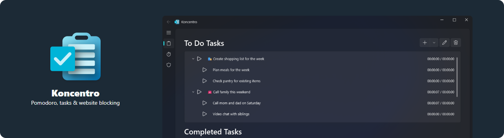
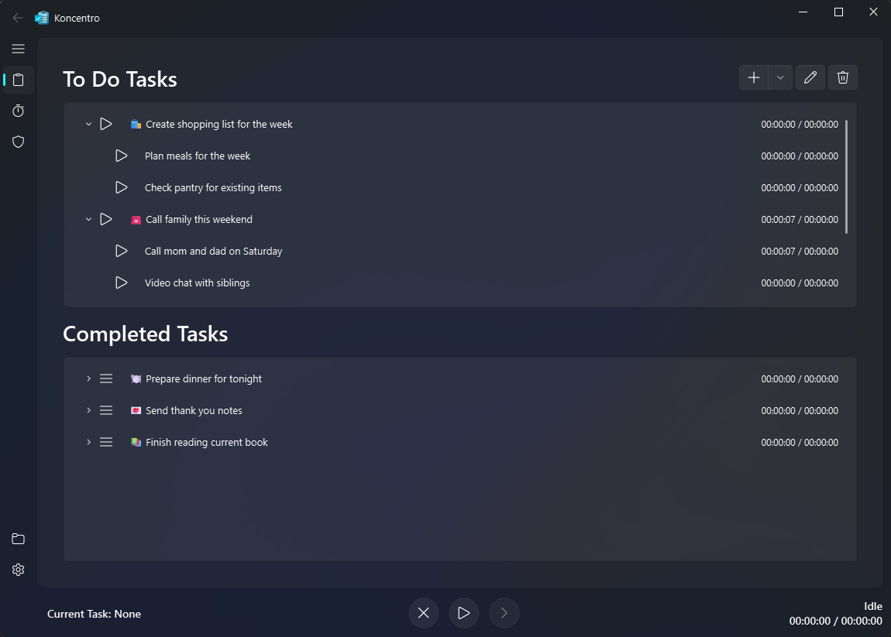
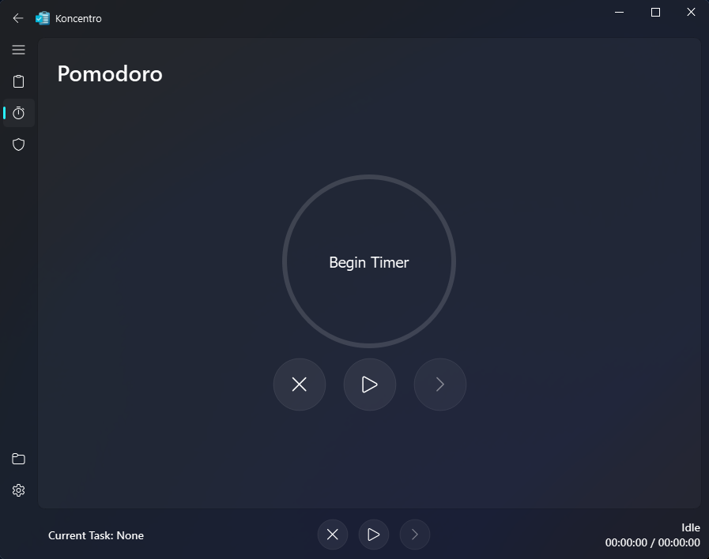
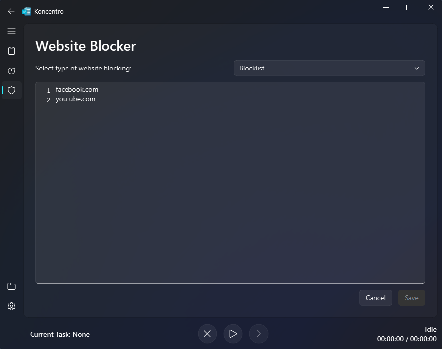
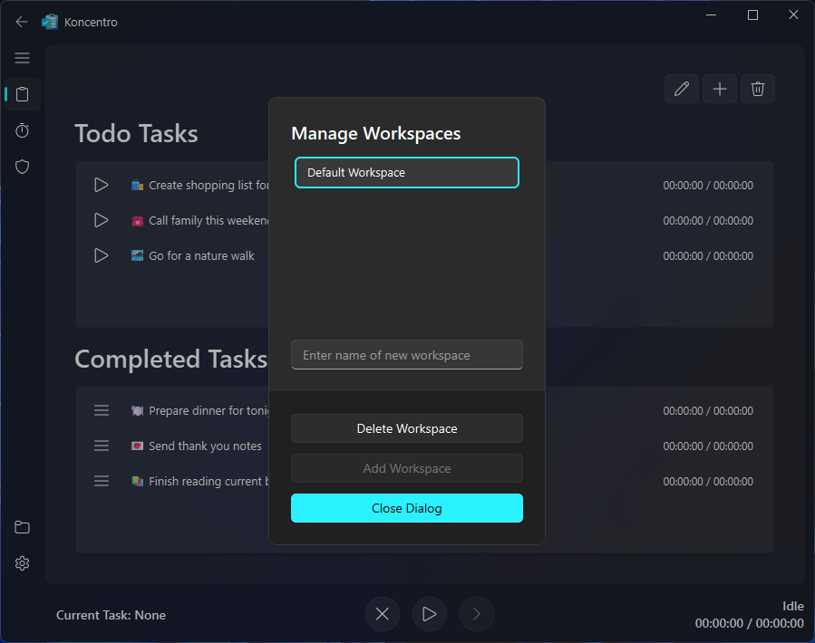
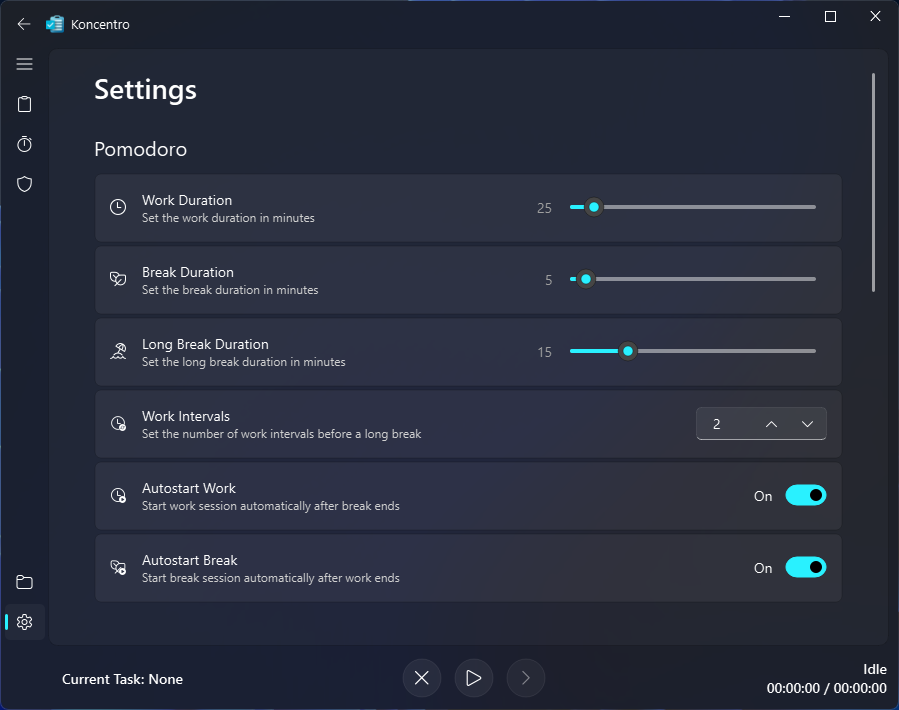

<h1 align="center">Koncentro</h1>

<p align="center">A powerful productivity app combining Pomodoro technique, task management, and website blocking.</p>

<p align="center">
  
</p>

<div align="center">

  [](https://wakatime.com/badge/github/kun-codes/koncentro)
  
  
  


</div>

> [!IMPORTANT]
> Koncentro assumes that you aren't using a proxy server already since it runs a local proxy server to block websites.

## Features

- **Cross Platform:** Koncentro works on Windows, macOS and Linux without using heavy frameworks like Electron.
- **Timeboxing:** Allocate a fixed duration to each task and aim to complete it within the time limit.
- **Website Blocker:** Koncentro includes an integrated website blocker that lets you choose to block distractions by either a blocklist or an allowlist.
- **Workspaces:** Each Workspace has its own set of Pomodoro timer settings, website blocker settings and task list, allowing you to separate work and personal projects.
- **Fluent Design:** Koncentro follows Microsoft's Fluent Design principles. It supports the Mica effect on Windows 11.


## Installation

### Installer

Installers for Koncentro are available for Windows, macOS and Linux. You can download the latest install from the [releases page](https://github.com/kun-codes/Koncentro/releases/latest)

#### Windows Installation

You can install Koncentro on Windows using [WinGet](https://learn.microsoft.com/en-us/windows/package-manager/winget/):

```sh
winget install --id=BishwaSaha.Koncentro -e
```

#### Linux Installation

You can install Koncentro on Linux using [Flathub](https://flathub.org):

```sh
flatpak install flathub com.bishwasaha.Koncentro
````


<details>
<summary><strong>From Source (Advanced)</strong></summary>

#### From Source

- Install [Python 3.12](https://www.python.org/downloads/) if you haven't already. You can also use a python version manager like [pyenv](https://github.com/pyenv/pyenv) to install Python 3.12.

  ```sh
  pyenv install 3.12
  ```

- Install [Poetry](https://python-poetry.org/docs/#installing-with-the-official-installer)
- Clone the repository using the command
```sh
git clone https://github.com/kun-codes/Koncentro.git
```
- Change the directory to the repository
```sh
cd Koncentro
```
- Make poetry use Python 3.12
```sh
poetry env use 3.12
```
- Install the dependencies using poetry
```sh
poetry install --no-root
```
- [Activate the virtual environment](https://python-poetry.org/docs/managing-environments/#activating-the-environment)
- Generate python resource files
```sh
./dev/generate-python-rc-files.sh
```
- Run the app using the command
```sh
python src
```
</details>

## Usage

1. Install Koncentro from the releases above or from source as described above.
2. Add your tasks in **tasks list** to get started.
3. Use the Pomodoro timer from **timer screen** to start a Pomodoro session
4. Configure website blocking in the **website blocker screen** by adding websites to the blocklist or allowlist.
5. Switch and create different workspaces using the **workspace manager** to manage separate sets of tasks and settings.

## Screenshots

### Task Lists


### Pomodoro Timer


### Website Blocker


### Workspace Manager


### Settings


## Known Bugs

- App doesn't change theme correctly without restarting when OS theme is changed.

## License
This project is licensed under the [GPL-3.0-or-later license](LICENSE).

## Supporter

<div align="center">
  <a href="https://www.repoflow.io/">
    
  </a>
</div>

- Thanks to [RepoFlow](https://www.repoflow.io/) for providing a license for hosting linux repositories.
 
## Credits

- [Super Productivity](https://github.com/johannesjo/super-productivity): The app is inspired by Super Productivity.
- [chomper](https://github.com/aniketpanjwani/chomper): The website blocker has some functionality inspired by chomper.
- [Flowkeeper](https://github.com/flowkeeper-org/fk-desktop): Installer creation scripts have been adapted from Flowkeeper.
- [Flathub Banner Preview](https://docs.flathub.org/banner-preview): For the banner image used in the README.
